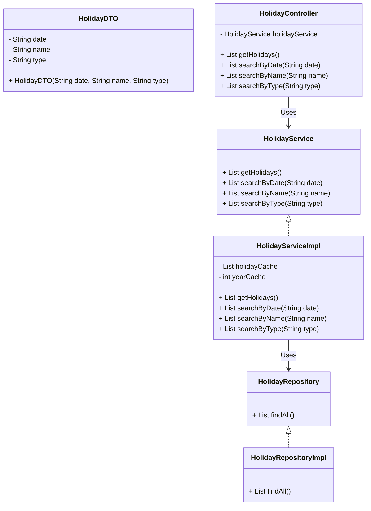

<p align="center">
  
</p>

# LuminaraDays

LuminaraDays é uma API que fornece informações sobre feriados de forma eficiente e organizada. Desenvolvida utilizando **Java Spring Boot**, a API permite que usuários consultem feriados nacionais e filtrá-los por data, nome e tipo.

Com um design modular e escalável, o projeto segue boas práticas de desenvolvimento e inclui **Swagger** para documentação interativa.

---

## 🛠️ Tecnologias Utilizadas

### **Backend**
| Tecnologia           | Descrição                          |
|---------------------|------------------------------------|
|  | Linguagem de programação principal. |
|  | Framework para aplicações Java.     |
|  | Ferramenta para documentação de APIs. |
|  | Biblioteca para web scraping. |

### **Fonte para scraping**
| API               | Ícone | Descrição                          | Link |
|-------------------|-------|------------------------------------|------|
| **Time and Date** | 📅   | Fornece informações sobre feriados | [TimeAndDate](https://www.timeanddate.com/holidays/) |

---

## 🚀 Execução

### **Backend** ☕
```bash
mvn spring-boot:run
```
O backend estará disponível na porta **8080** por padrão.

---

## 💡 Funcionalidades
- 📆 Consulta de feriados nacionais
- 🔍 Filtragem por data, nome ou tipo
- 🚀 API documentada com Swagger

---

## Diagrama de classe


---

## 📖 Documentação
A documentação da API pode ser acessada via Swagger:
```
http://localhost:8080/swagger-ui/
```

---
**Desenvolvido por [Ricardo](https://github.com/RLC02)** ✨
