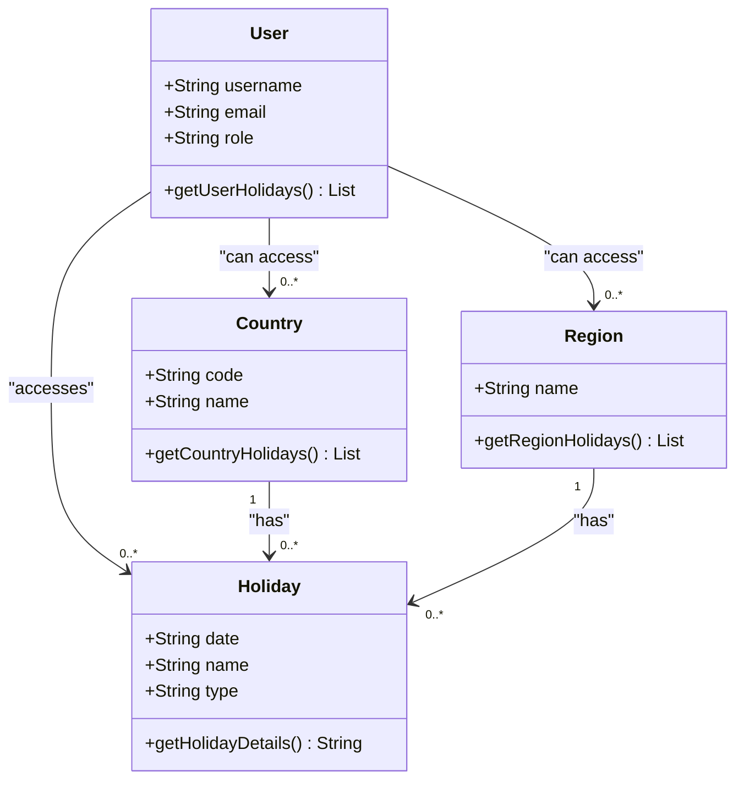

# LuminaraDays
Datas que brilham no tempo. Api de consulta de feriados e eventos marcantes de qualquer lugar do mundo.

## Diagrama de Classe

```mermaid
classDiagram
    class Holiday {
        +String date
        +String name
        +String type
        +getHolidayDetails() String
    }
    class Country {
        +String code
        +String name
        +getCountryHolidays() List<Holiday>
    }
    class Region {
        +String name
        +getRegionHolidays() List<Holiday>
    }
    class User {
        +String username
        +String email
        +String role
        +getUserHolidays() List<Holiday>
    }

    User --> "0..*" Holiday : "accesses"
    Country "1" --> "0..*" Holiday : "has"
    Region "1" --> "0..*" Holiday : "has"
    User --> "0..*" Region : "can access"
    User --> "0..*" Country : "can access"
```
